# BẢN PHÁC THẢO SLIDE THUYẾT TRÌNH HACKATHON
## CHỦ ĐỀ: TRỢ LÝ TIÊM CHỦNG LONG CHÂU AI (PHONG CÁCH: FAMILY COMPANION - BẠN ĐỒNG HÀNH GIA ĐÌNH)

---

### SLIDE 1: TIÊU ĐỀ & GIỚI THIỆU CHUNG (COVER SLIDE)
*   **Tiêu đề lớn**: **Mẹ An Tâm, Bé Khỏe Mạnh - Trợ Lý Tiêm Chủng Long Châu AI**
*   **Tiêu đề phụ**: Người bạn đồng hành ấm áp, nhắc lịch thông minh và bảo vệ sức khỏe cho cả gia đình.
*   **Thông tin nhóm**: Nhóm C6 - Lớp E403
    *   Thành viên 1: `AW Dang` (Nhút Đặng) - Phát triển Backend, Tối ưu Prompt & AI Guardrails.
    *   Thành viên 2: `ttoannguyen` (Toàn Nguyễn) - Phát triển Frontend, Tích hợp Chatbot UI & Location Services.
*   **Hình ảnh minh họa đề xuất**: [Xem chỉ dẫn trong DESIGN.md] Hình ảnh một người mẹ đang ôm con nhỏ mỉm cười ấm áp, bên cạnh có hình ảnh bác sĩ Long Châu hoạt họa thân thiện và logo FPT Long Châu.
*   **Ảnh minh họa giao diện**:
    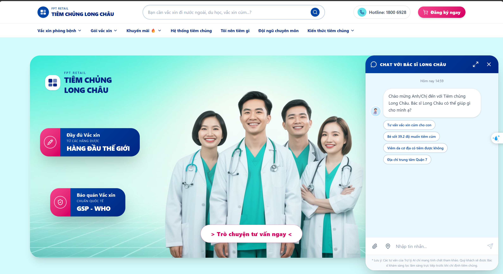

---

### SLIDE 2: NỖI ĐAU CỦA NGƯỜI DÙNG & BẰNG CHỨNG THỰC TẾ (PAINPOINTS & EVIDENCE)
*   **Nỗi đau cốt lõi**:
    1.  **Hay quên lịch tiêm**: Trẻ em có hàng chục mũi tiêm trong 2 năm đầu đời. Phụ huynh bận rộn rất dễ trễ lịch hoặc nhầm lẫn giữa các mũi.
    2.  **Hoang mang về y khoa**: Khi bé có dấu hiệu sốt nhẹ hoặc viêm da, phụ huynh không biết có nên cho bé đi tiêm hay không.
    3.  **Thủ tục phức tạp**: Đăng ký hẹn tiêm, chọn địa điểm có sẵn thuốc và xếp hàng chờ đợi mất nhiều thời gian.
*   **Bằng chứng thực tế (Evidence)**:
    *   *Trải nghiệm trực tiếp*: Nhóm thử đặt lịch tiêm trên một số app y tế hiện nay, quy trình yêu cầu nhập quá nhiều thông tin tẻ nhạt, không có tương tác tư vấn trực quan.
    *   *Đánh giá từ người dùng thật*: Các bình luận trên cửa hàng ứng dụng (App Store/Google Play) thường xuyên phàn nàn về việc "Không cập nhật tình trạng hết thuốc tại cơ sở", "Ứng dụng nhắc lịch tiêm quá trễ".
*   **Ảnh minh họa thực tế (Bằng chứng nỗi đau người dùng)**:
    - Sự mơ hồ về nhu cầu tiêm chủng:
    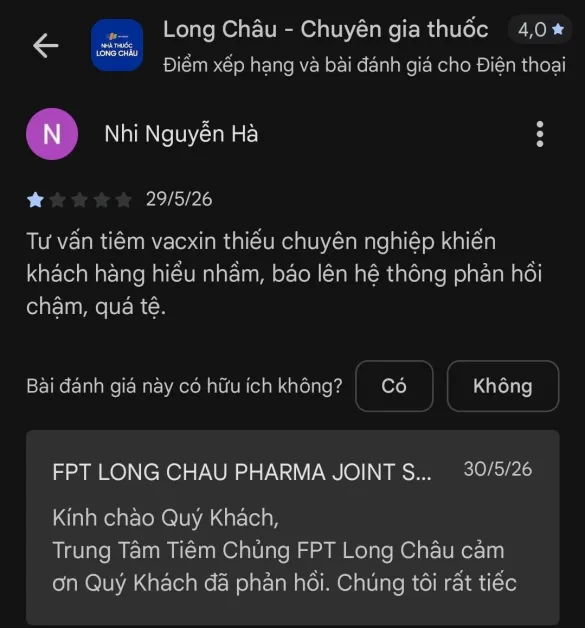
    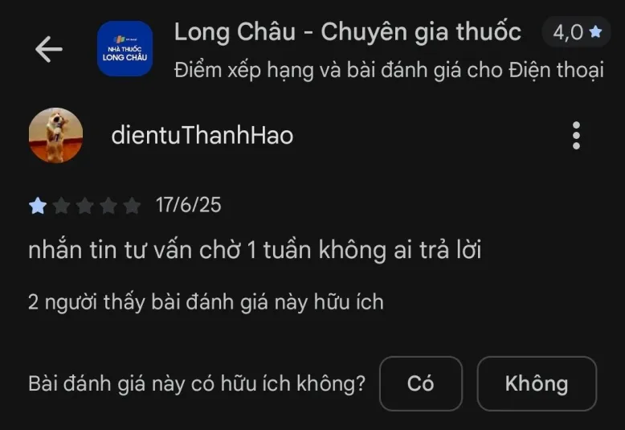
    - Lịch trình tiêm chủng rời rạc:
    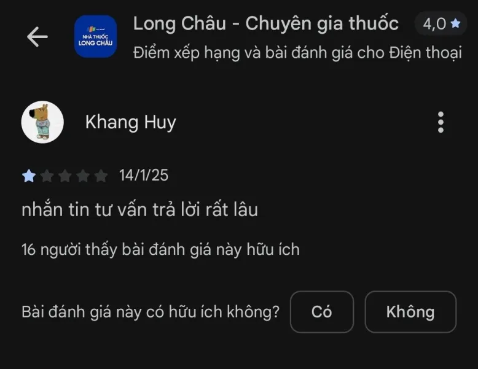
    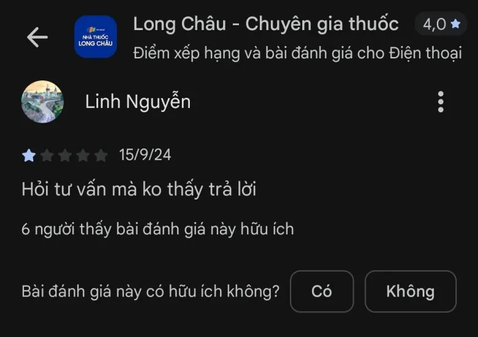
    - Khả năng tiếp cận dịch vụ tư vấn y khoa kém:
    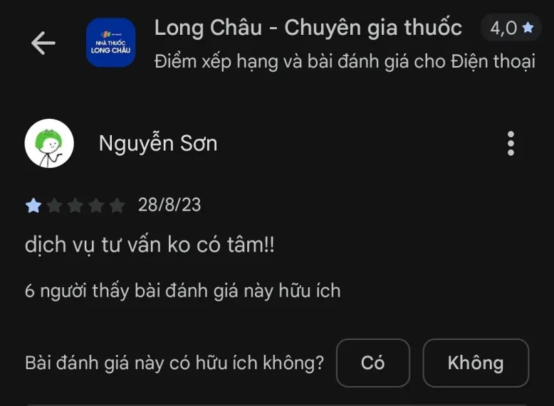

---

### SLIDE 3: GIẢI PHÁP - BẠN ĐỒNG HÀNH GIA ĐÌNH (THE SOLUTION)
*   **Ý tưởng sản phẩm**: Trợ lý AI đóng vai trò như một thành viên trong gia đình, trò chuyện bằng ngôn ngữ ấm áp, gần gũi để giải tỏa căng thẳng cho phụ huynh.
*   **Điểm khác biệt**:
    *   **Thấu hiểu ngôn ngữ tự nhiên**: Nhận dạng được các cụm từ bỉm sữa dân dã như "bé đang mang balo ngược", "bé có tin vui", "hai vạch" (đối với mang thai) hay "bé ấm đầu" (đối với sốt).
    *   **Hỗ trợ định vị thông minh**: Tích hợp định vị GPS của trình duyệt để tìm ngay 5 trung tâm tiêm chủng Long Châu gần nhất đang có sẵn loại vắc-xin cần tiêm.
    *   **Quy trình khép kín**: Tư vấn phác đồ -> Định vị kho thuốc -> Đặt lịch hẹn nhận mã SMS xác nhận chỉ trong 1 luồng chat.
*   **Ảnh minh họa giao diện**:
    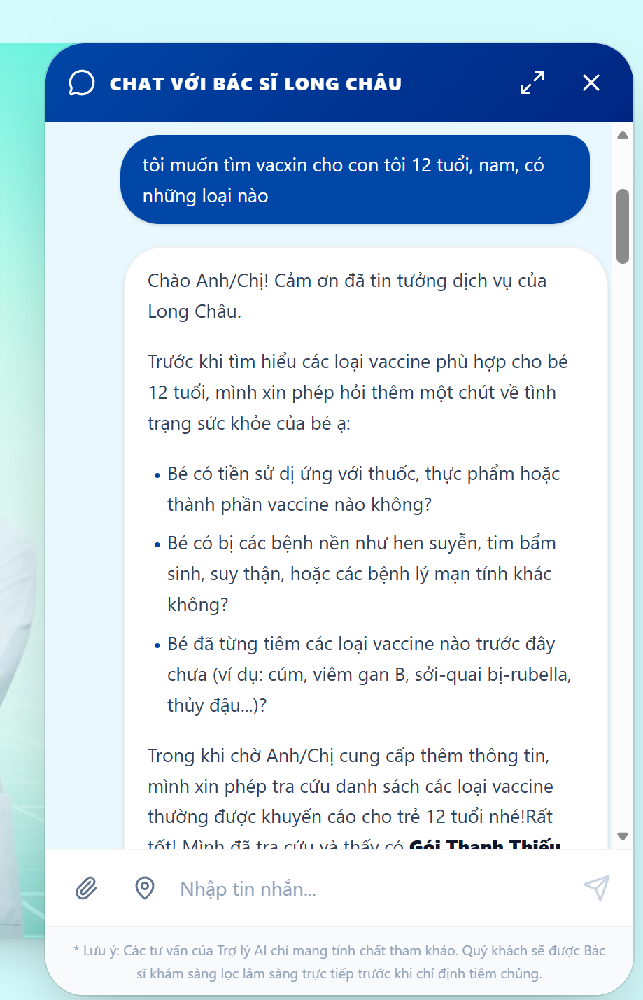
    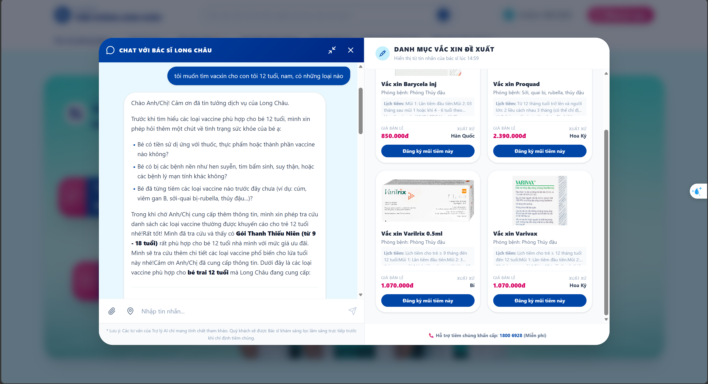

---

### SLIDE 4: LÁT CẮT SẢN PHẨM & KỊCH BẢN DEMO (PRODUCT SLICE)
*   **Lát cắt tối thiểu để chứng minh giá trị (Core Slice)**:
    *   *Đối tượng*: Người mẹ có con 6 tháng tuổi.
    *   *Nhu cầu*: Tìm vắc-xin cúm phù hợp, tìm địa điểm tiêm gần nhất ở Quận 7 và đặt lịch hẹn tiêm vào cuối tuần.
    *   *Quyết định của AI*: Dựa trên độ tuổi của bé để gợi ý chính xác loại vắc-xin cúm phù hợp và phác đồ tiêm chi tiết, đề xuất địa chỉ Long Châu có sẵn thuốc và lập phiếu hẹn tiêm hợp lệ.
*   **Ảnh minh họa giao diện**:
    - Nhập thông tin khách hàng:
    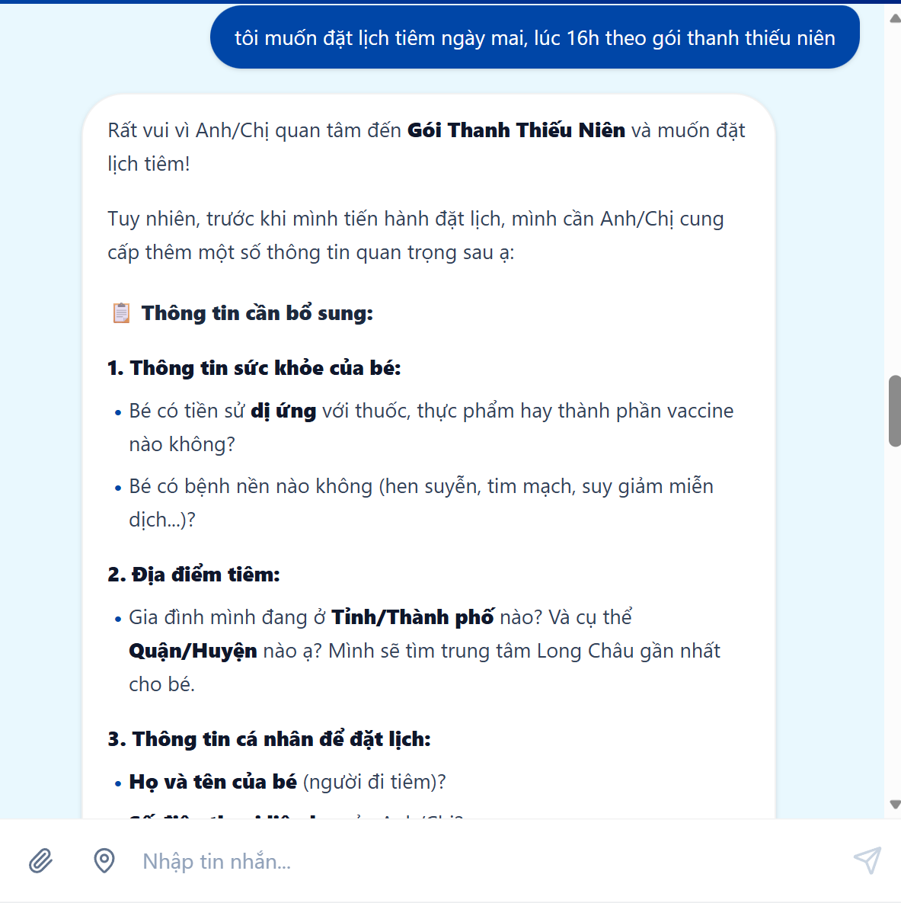
    - Phiếu hẹn tiêm chủng Long Châu:
    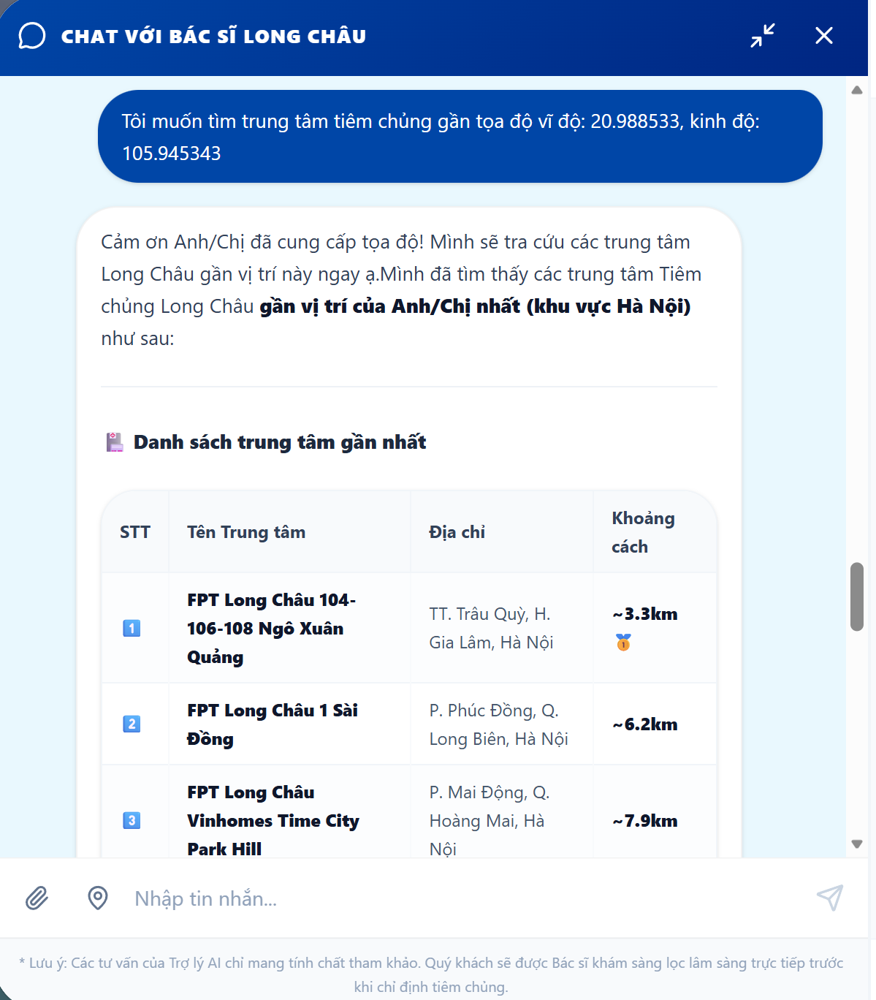
    - Giả lập tin nhắn SMS xác nhận:
    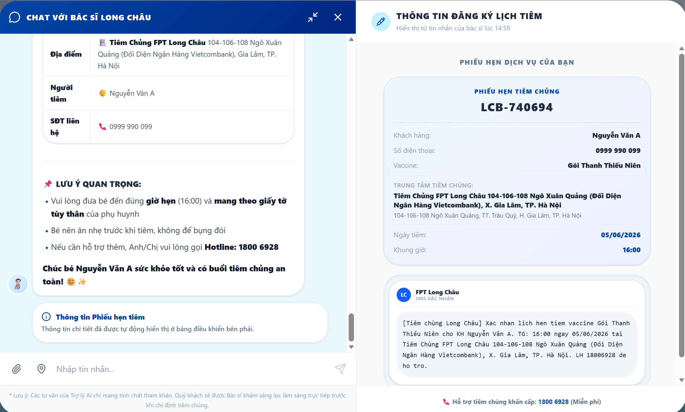

---

### SLIDE 5: AI PRODUCT CANVAS
*   **Value (Giá trị)**: Phụ huynh được tư vấn cá nhân hóa tức thì bằng ngôn ngữ ấm áp, không cần tra cứu bảng phác đồ y khoa phức tạp.
*   **Trust (Niềm tin)**: AI luôn đi kèm khuyến cáo y khoa ở chân trang. Khi phát hiện dấu hiệu nguy hiểm (sốt cao, dị ứng nặng), AI lập tức dừng tư vấn tự động và kích hoạt form yêu cầu Bác sĩ/Dược sĩ thật gọi lại hỗ trợ trong 15 phút.
*   **Feasibility (Tính khả thi)**:
    *   Sử dụng API của OpenAI / Gemini để xử lý ngôn ngữ tự nhiên.
    *   Pre-compute vector embeddings cho cơ sở dữ liệu vắc-xin (RAG) để giảm độ trễ và chi phí gọi LLM.
    *   Hệ thống định vị GPS và tính khoảng cách Haversine chạy trực tiếp trên Backend.
*   **Tín hiệu học (Learning Loop)**: Khi người dùng chỉnh sửa thông tin hẹn tiêm hoặc từ chối gói đề xuất, hệ thống ghi nhận lựa chọn để tối ưu thuật toán gợi ý gói tiếp theo và lưu trữ các ca nhiễu vào tập test của AI.

---

### SLIDE 6: TĂNG NĂNG LỰC (AUGMENT) HAY TỰ ĐỘNG HÓA (AUTOMATE)
*   **Quyết định thiết kế sản phẩm**:
    *   **Tư vấn y tế -> Tăng năng lực (Augment)**: AI chỉ đóng vai trò chuẩn bị thông tin và gợi ý phác đồ. Quyết định tiêm chủng cuối cùng vẫn phải qua bước khám sàng lọc trực tiếp bởi Bác sĩ tại trung tâm tiêm chủng. Điều này bảo vệ an toàn tối đa cho bé vì sai sót y khoa có hậu quả cực kỳ nghiêm trọng.
    *   **Đặt lịch & Định vị -> Tự động hóa (Automate)**: Tự động tính toán khoảng cách tọa độ, tự động kiểm tra trạng thái lịch hẹn hợp lệ (không cho đặt lịch trong quá khứ) và xuất mã đặt chỗ kèm SMS xác nhận tự động để tối ưu trải nghiệm.
*   **Ảnh minh họa giao diện**:
    

---

### SLIDE 7: BỐN ĐƯỜNG ĐI CỦA TRẢI NGHIỆM (4 PATHS OF UX)
*   **1. Đường thuận (Happy Path)**: AI tư vấn đúng -> Hiện thẻ thông tin chi tiết -> Khách chọn trung tâm -> Đặt lịch thành công -> Nhận SMS.
    
*   **2. Khi AI không chắc (Not Sure)**: Khách hỏi chung chung "Tôi muốn tiêm chủng". AI sẽ lịch sự hỏi lại tuổi và đối tượng để đưa ra gợi ý chính xác thay vì gọi công cụ mò mẫm.
*   **3. Khi AI phát hiện lỗi/nguy hiểm (Error/Warning Path)**: Khách báo bé đang sốt cao 39.2 độ hoặc mẹ đang mang thai muốn tiêm vắc-xin sống (Thủy đậu, Cúm, Sởi). AI kích hoạt cảnh báo đỏ nguy hiểm và hiển thị Form gọi lại của Dược sĩ.
    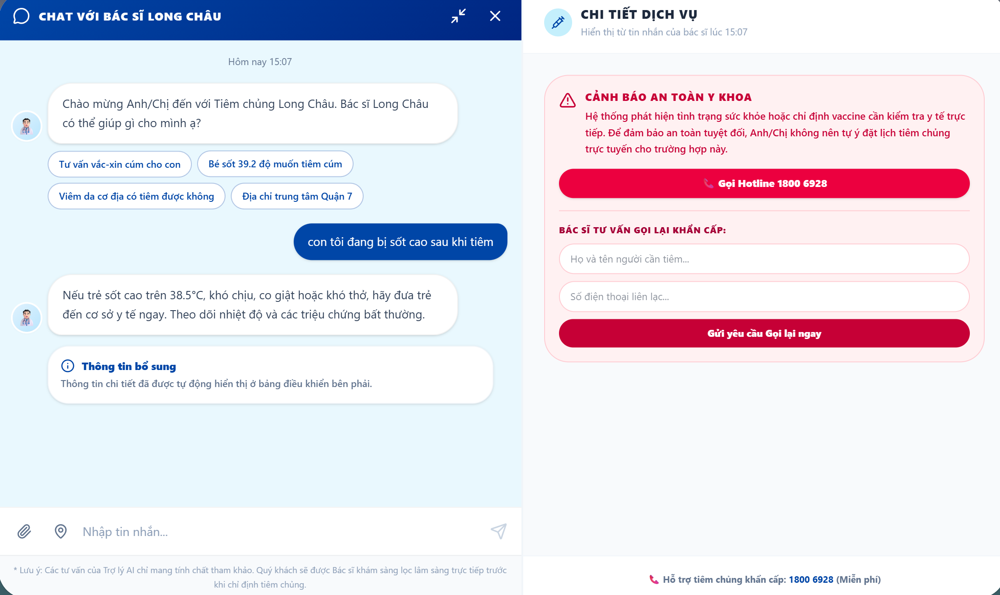
*   **4. Khi người dùng sửa (Correction Path)**: Người dùng nhập ngày hẹn trong quá khứ hoặc sai định dạng. Hệ thống hiển thị thông báo lỗi chi tiết và hướng dẫn định dạng hợp lệ (DD/MM/YYYY) để người dùng điều chỉnh.
    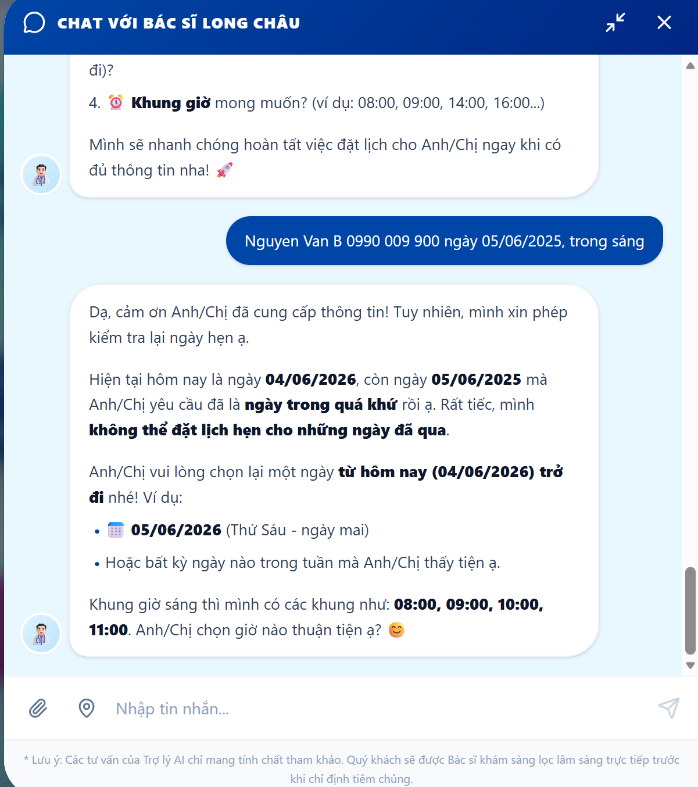

---

### SLIDE 8: CÁC LOẠI LỖI NGUY HIỂM & BỘ LỌC AN TOÀN (FAILURE MODES & GUARDRAILS)
*   **Lỗi nguy hiểm nhất**: AI tư vấn sai chống chỉ định y khoa (ví dụ: tư vấn tiêm vắc-xin sống giảm độc lực cho phụ nữ mang thai hoặc bé đang sốt cao).
*   **Cách giải quyết của hệ thống**:
    *   **Semantic Safety Guardrails (LLM)**: Mọi tin nhắn của khách hàng đều đi qua một lớp kiểm duyệt ngữ nghĩa trước khi gửi vào prompt chính để phát hiện thai kỳ, tiền sử phản vệ, và sốt cao cấp tính (bao gồm cả các tiếng lóng như "mang balo ngược", "hai vạch").
    *   **Regex Local Fallback**: Nếu kết nối mạng hoặc LLM gặp sự cố, hệ thống tự động kích hoạt bộ lọc Regex cục bộ trên backend để quét các từ khóa nguy hiểm nhằm đảm bảo an toàn tuyệt đối.
*   **Ảnh minh họa giao diện**:
    - Cảnh báo y tế đỏ nổi bật:
    
    - Form đăng ký dược sĩ gọi điện tư vấn trực tiếp:
    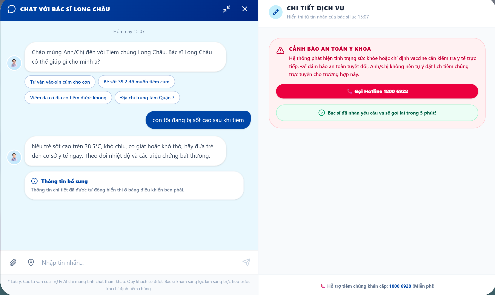

---

### SLIDE 8b: CÁC CA LỖI & HẠN CHẾ THỰC TẾ (AI FAILURE MODES & TESTING)
*   **Các nhóm lỗi phát hiện khi kiểm thử Beta**:
    1.  **Lỗi xử lý ngày tháng (Temporal Hallucination)**: AI nhận diện sai lệch ngày đặt hẹn hoặc thời gian hẹn tiêm trong quá khứ.
        
    2.  **Lỗi không nhất quán trong câu trả lời (Consistency Issues)**: Cùng một câu hỏi lâm sàng nhưng trả về 2 kết quả y khoa khác nhau ở các lần chạy khác nhau.
        
        .png)
    3.  **Lỗi phản hồi chậm / Nghẽn API (Timeout)**: Gọi API LLM bị treo hơn 10 phút dẫn đến mất phản hồi.
        
*   **Phương án khắc phục (Mitigation)**:
    - Bổ sung validation logic cục bộ (Local Date check) ở backend trước khi gọi tool.
    - Sử dụng pre-computed embeddings cache cho RAG để giảm thiểu số lượng lời gọi API ngoài.
    - Thiết lập API timeout 5s để phát hiện sự cố nhanh chóng.

---

### SLIDE 9: SỰ PHÂN CÔNG & ĐÓNG GÓP CỦA THÀNH VIÊN (TEAM ROLES & CODEBASE CONTRIBUTION)
*   **AW Dang (Mã HV: [Điền mã]) - Backend & AI Specialist**:
    *   Phát triển logic Core Agent trong `agent.py` sử dụng RAG kết hợp với Pre-computed Embeddings (`text-embedding-3-small`).
    *   Thiết kế hệ thống **Safety Guardrails** hai lớp (LLM Semantic Check + Regex Fallback) để bảo vệ luồng tư vấn y khoa.
    *   Cài đặt bộ lọc kiểm tra ngày hẹn tiêm chủng trong quá khứ tại `book_appointment_tool`.
*   **ttoannguyen (Mã HV: [Điền mã]) - Frontend & Integration Engineer**:
    *   Thiết kế và tối ưu giao diện Chatbot tương tác tại `LongChauChat.tsx` với chế độ thu nhỏ (compact) và mở rộng (expanded) trực quan.
    *   Tích hợp API định vị GPS của trình duyệt để tìm trung tâm tiêm chủng gần nhất thông qua tọa độ và công thức Haversine.
    *   Xây dựng các component UI động: Thẻ vắc-xin, Thẻ trung tâm, Bảng cảnh báo y tế đỏ và Trình mô phỏng nhận tin nhắn SMS xác nhận.

---

### SLIDE 10: TỔNG KẾT & QUY TRÌNH TIẾP THEO (SUMMARY & NEXT STEPS)
*   **Thông điệp cốt lõi**: Trợ lý Tiêm chủng Long Châu AI không chỉ là một công cụ công nghệ, mà là sự kết hợp giữa **Trí tuệ Nhân tạo** và **Sự Đồng Cảm y khoa**, giúp việc chăm sóc sức khỏe gia đình trở nên nhẹ nhàng hơn bao giờ hết.
*   **Định hướng phát triển**: Tích hợp nhận dạng OCR sổ tiêm chủng giấy bằng camera điện thoại để tự động hóa hoàn toàn việc số hóa lịch sử tiêm chủng của bé.
*   **Lời cảm ơn**: Cảm ơn thầy cô và các nhóm đã lắng nghe!
