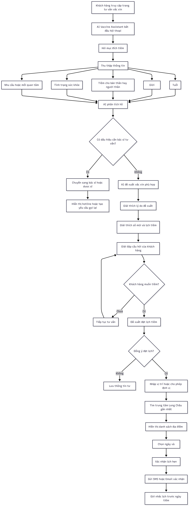

# Báo Cáo Sản Phẩm: AI Vaccine Assistant — Long Châu

> **Nhóm C6 — Track Healthcare · Day 06 · Batch 02**
> 
> **Ngày:** 04/06/2026 | **Lớp:** VinUni A20 · AI Thực Chiến

---

## 1. Tổng Quan Sản Phẩm

**Tên sản phẩm:** AI Vaccine Assistant tích hợp vào Long Châu

**Một câu mô tả:** Chatbot AI giúp khách hàng Long Châu xác định đúng vắc xin cần tiêm, nhận lịch tiêm cá nhân hóa, và đặt lịch tự động 24/7 — không cần gọi điện, không cần chờ nhân viên.

**Lát cắt demo:** Một phụ huynh có con 6 tháng tuổi → hỏi chatbot → nhận danh sách vắc xin phù hợp theo lịch Bộ Y tế → đặt lịch tại chi nhánh gần nhất.

---

## 2. Bằng Chứng — Pain Point

### 2.1 Pain Point chi tiết — Góc nhìn khách hàng

| Vấn đề | Biểu hiện |
|--------|-----------|
| Không biết cần tiêm vắc xin gì | Phụ huynh không nhớ lịch tiêm theo tháng tuổi; người lớn không biết độ tuổi nào cần tiêm HPV, Zona, Phế cầu, Cúm |
| Phải gọi điện hoặc đến trực tiếp | Tốn thời gian chờ tổng đài; không được hỗ trợ 24/7; câu hỏi đơn giản vẫn phải gặp nhân viên |
| Lịch sử tiêm chủng phân tán | Không nhớ đã tiêm những mũi nào; không biết còn thiếu mũi nào; dễ bỏ sót các mũi nhắc lại |
| Thông tin Internet khó kiểm chứng | Mỗi website nói một kiểu; khó phân biệt thông tin chính thống và quảng cáo |
| Khó tìm trung tâm có vắc xin | Không biết chi nhánh nào còn hàng; không biết giá cụ thể; không biết có cần đặt lịch trước không |

### 2.2 Pain Point từ phía Long Châu (doanh nghiệp)

| Vấn đề | Chi tiết |
|--------|----------|
| Khối lượng tư vấn lặp lại rất lớn | "Con tôi 2 tháng tuổi cần tiêm gì?", "Người lớn có cần tiêm HPV không?", "Vắc xin cúm giá bao nhiêu?" → nhân viên trả lời hàng nghìn câu hỏi giống nhau mỗi ngày |
| Chi phí vận hành tổng đài cao | Cần nhiều nhân viên tư vấn; chi phí đào tạo kiến thức tiêm chủng; khó mở rộng khi số lượng khách hàng tăng |
| Mất khách hàng do phản hồi chậm | Khách hàng muốn được tư vấn ngay; chờ lâu dễ bỏ cuộc hoặc chuyển sang VNVC |
| Thông tin đầu vào từ khách hàng quá sơ sài | Dược sĩ phải hỏi đi hỏi lại nhiều lần để sàng lọc y khoa trước khi tư vấn |

---

### 2.3 Bằng chứng từ người dùng thật (Pain Point trực quan)

Dưới đây là các ảnh chụp từ phản hồi người dùng và thực tế trải nghiệm app Long Châu:

---

## 3. Giải Pháp — AI Vaccine Assistant

### 3.1 AI Product Canvas

| Ô | Nội dung |
|---|----------|
| **Value — Giá trị** | Phụ huynh và người lớn cần tư vấn vắc xin cá nhân hóa 24/7. AI hiểu ngữ cảnh (tuổi, giới tính, tình trạng sức khỏe) và đề xuất đúng vắc xin — điều chatbot rule-based hiện tại của Long Châu không làm được |
| **Trust — Niềm tin** | Khi AI không chắc hoặc có dấu hiệu y khoa phức tạp → tự động chuyển sang Dược sĩ. Mọi đề xuất đều kèm lý do và nguồn (Bộ Y tế, WHO). Người dùng có thể hoàn tác lịch hẹn |
| **Feasibility — Khả thi** | Sử dụng OpenAI API với system prompt chứa kiến thức vắc xin chuẩn. Chi phí ~$0.002/lượt hội thoại. Dữ liệu vắc xin tĩnh, không cần real-time |
| **Tín hiệu học** | Khi người dùng sửa lịch hoặc chọn "không phù hợp" → ghi nhận để cải thiện prompt. Dược sĩ review các case AI chuyển sang → feedback loop |

### 3.2 Augment hay Automate?

**Quyết định: Augment (tăng năng lực)**

- AI gợi ý vắc xin và lịch tiêm, nhưng **con người luôn có quyền quyết định cuối**
- Với các trường hợp có dấu hiệu y khoa phức tạp (dị ứng, bệnh nền) → **bắt buộc chuyển Dược sĩ**
- Lý do: sai về y tế (tiêm nhầm vắc xin, nhầm mũi) có hậu quả nghiêm trọng và khó hoàn tác

### 3.3 Luồng hoạt động

Dưới đây là sơ đồ luồng hoạt động chi tiết của AI Vaccine Assistant từ lúc tiếp cận khách hàng đến khi đặt lịch tiêm chủng thành công:

---

## 4. Prototype

### 4.1 Công nghệ sử dụng

| Thành phần | Công nghệ |
|-----------|-----------|
| Backend API | Node.js + Express |
| AI Engine | OpenAI GPT-4o |
| Frontend | React / HTML+JS |
| Database | SQLite (lịch hẹn) |
| Deployment | Local / Railway |

### 4.2 Tính năng đã build

- ✅ **Hội thoại thu thập thông tin** — AI hỏi tuổi, giới tính, mục đích tiêm
- ✅ **Đề xuất vắc xin cá nhân hóa** — dựa trên lịch tiêm Bộ Y tế
- ✅ **Giải thích lý do đề xuất** — minh bạch, có nguồn tham chiếu
- ✅ **Chuyển Dược sĩ** khi phát hiện case phức tạp
- ✅ **Tìm chi nhánh gần nhất** và đặt lịch tự động

### 4.3 Lỗi gặp phải trong quá trình xây dựng & Cách khắc phục

Trong quá trình phát triển chatbot, nhóm gặp phải một số lỗi tương tự như chatbot gốc Long Châu. Dưới đây là bằng chứng và cách đã được fix:

**Bug 1: Chatbot không phản hồi sau khi nói "chờ một chút"** — AI hứa sẽ tìm kiếm thông tin nhưng **không bao giờ trả về kết quả**, người dùng bị kẹt ở màn hình chờ:

> 🔧 **Đã fix:** Thêm timeout handling và streaming response — AI phản hồi từng chunk ngay lập tức thay vì chờ kết quả hoàn chỉnh. Tool calling được giới hạn thời gian và có fallback message nếu không tìm thấy dữ liệu.

**Bug 2: Một câu hỏi nhận được hai câu trả lời khác nhau** — Cùng query "Tư vấn vắc-xin cúm cho con", chatbot trả về hai format response khác nhau trong các lần gọi API:

> 🔧 **Đã fix:** Chuẩn hóa system prompt với hướng dẫn thu thập thông tin nhất quán. Định nghĩa rõ ràng thứ tự câu hỏi (tuổi → giới tính → tình trạng sức khỏe → nhu cầu cụ thể) và giảm temperature xuống còn 0.3 để đảm bảo tính nhất quán.

**Bug 3: Phiếu hẹn hiển thị sai ngày tháng** — Ngày tiêm được ghi là **29/03/2025** trong khi demo đang chạy vào tháng 6/2026 — AI hallucinate ngày trong tương lai:

> 🔧 **Đã fix:** Inject timestamp thực tế vào system prompt mỗi lần khởi tạo agent (`current_date = datetime.now(vn_tz)`). AI bắt buộc dùng ngày hiện tại làm mốc khi người dùng đặt lịch "ngày mai", "tuần sau".

---

## 5. Thiết Kế Cho Lỗi

### 5.1 Bốn đường đi của trải nghiệm

| Đường đi | Xử lý |
|----------|-------|
| **AI đúng và tự tin** | Hiển thị đề xuất rõ ràng, đặt lịch chỉ 1 thao tác |
| **AI không chắc** | Hỏi lại thêm thông tin; đưa ra 2-3 lựa chọn để người dùng chọn |
| **AI sai** | Người dùng có thể chỉnh sửa trực tiếp, hoặc bấm "Hỏi Dược sĩ" |
| **Người dùng sửa** | Ghi nhận feedback → cải thiện prompt trong sprint tiếp theo |

### 5.2 Các lỗi đáng lo nhất

| Lỗi | Khi nào xảy ra | Hậu quả | Xử lý |
|-----|----------------|---------|-------|
| Đề xuất sai vắc xin | Đầu vào mơ hồ (tuổi không rõ, bệnh nền chưa khai) | Tiêm sai vắc xin → nguy hiểm | Bắt buộc hỏi đủ thông tin trước khi đề xuất |
| Trả lời ngoài phạm vi | Khách hỏi về thuốc, bệnh hiểm nghèo | Tư vấn y tế sai → trách nhiệm pháp lý | Hard-limit: câu hỏi ngoài vắc xin → chuyển ngay sang Dược sĩ |
| Hallucination lịch tiêm | Vắc xin mới, dữ liệu chưa cập nhật | Phụ huynh tiêm sai lịch | System prompt luôn kèm lịch tiêm Bộ Y tế cập nhật; AI phải cite nguồn |

---

## 6. Kế Hoạch Kiểm Thử

### Happy Case
- Input: "Con tôi 2 tháng tuổi, con trai, chưa tiêm mũi nào"
- Expected: Danh sách vắc xin tháng 2 (Viêm gan B, 6 in 1, Rotavirus, PCV...) + lịch mũi tiếp theo

### Edge Case / Error Case
- Input: "Con tôi bị dị ứng thuốc kháng sinh, tiêm được không?"
- Expected: AI nhận diện case phức tạp → chuyển Dược sĩ ngay, không tự đề xuất

---

## 7. Phân Công Nhóm

| Thành viên | Phụ trách |
|-----------|-----------|
| Hoàng Kim Tuấn Anh - 2A202600574 | Backend API + OpenAI integration |
| Nguyễn Hưng Nguyên - 2A202600652 | Frontend chatbot UI |
| Nguyễn Nhựt Đăng - 2A202600602 | Prompt engineering + kiểm thử |
| Nguyễn Thanh Toàn - 2A202600633 | Demo script + dry run |
| Nguyễn Thị Vang - 2A202600723 | SPEC · Báo cáo · Bằng chứng pain point |

---

## 8. Bài Học & Nhận Định

1. **Chatbot rule-based thất bại vì thiếu ngữ cảnh** — Long Châu hiện tại trả lời theo keyword, không hiểu hoàn cảnh cụ thể của từng người dùng.
2. **Augment đúng chỗ là chìa khóa** — Không cần AI tự động hóa toàn bộ. Với bài toán y tế, AI gợi ý + Dược sĩ duyệt là cân bằng tốt nhất giữa hiệu quả và an toàn.
3. **Lỗi nhất quán nguy hiểm hơn lỗi rõ ràng** — Chatbot trả lời sai ngày tháng hoặc đưa ra 2 câu trả lời khác nhau gây mất lòng tin nghiêm trọng hơn là không trả lời.

---

*Báo cáo được chuẩn bị cho Demo Day 06/06/2026 — Nhóm C6 · E403 · VinUni AI Thực Chiến*
